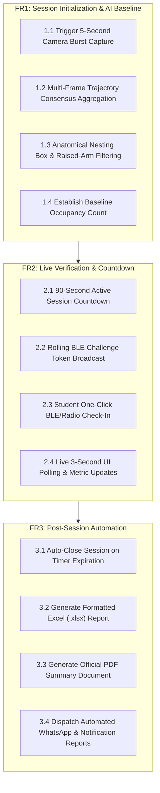
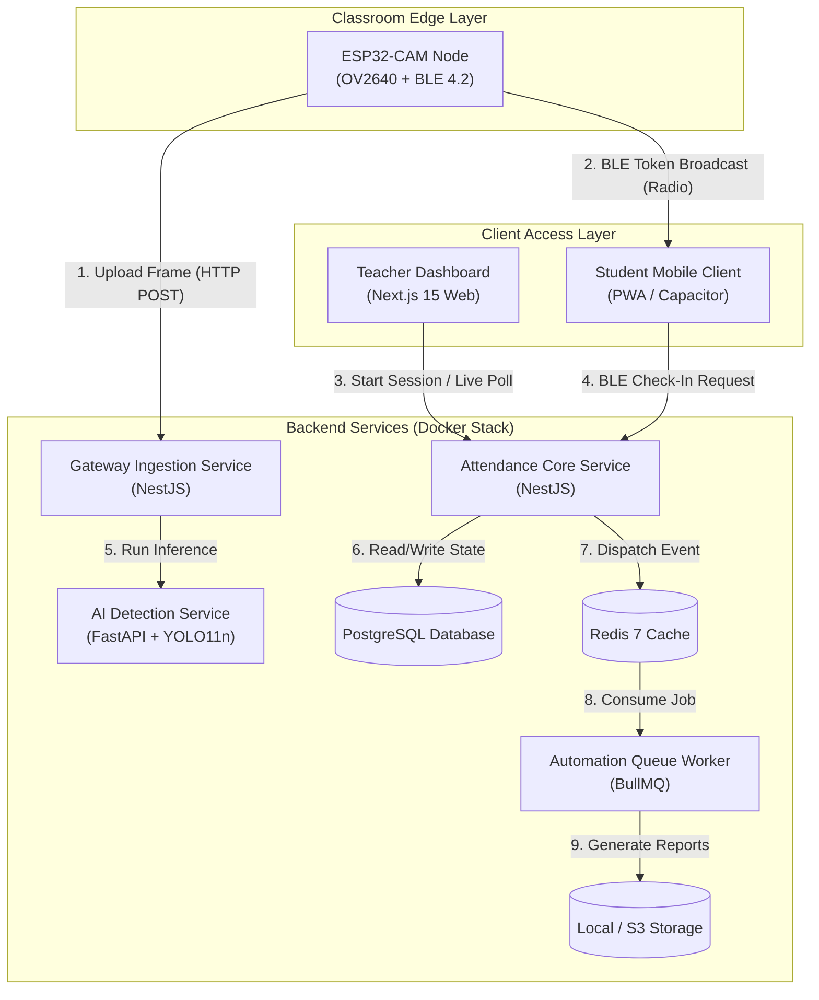
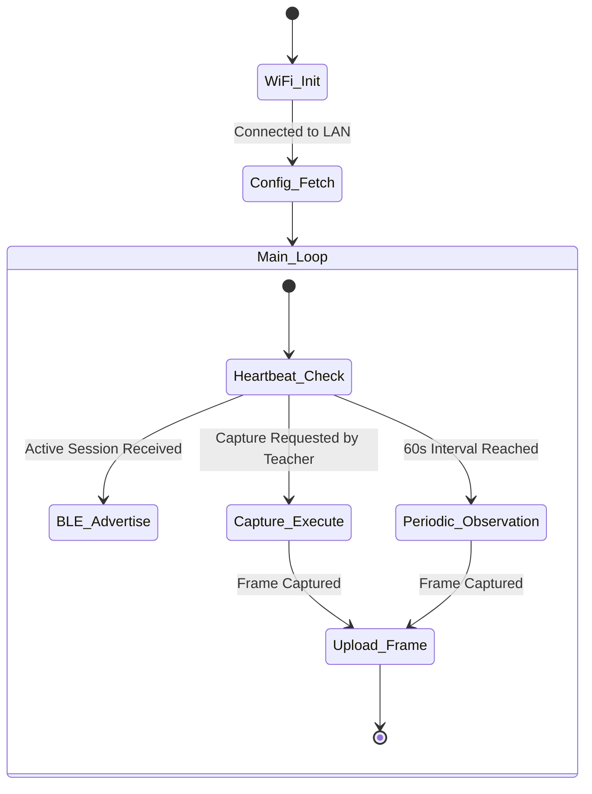
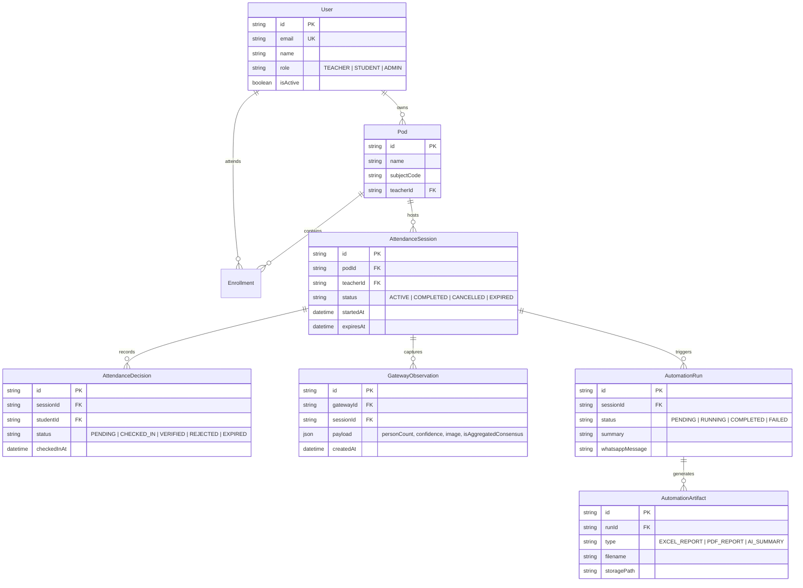

# 📘 ClassPod: Product Requirements Document (PRD) & Total System Architecture Report

**Version:** 2.0 (Production & Edge Ready)  
**Date:** August 11, 2026  
**Document Status:** Approved & Production Deployed  

---

## 1. Product Overview & Vision

### 1.1 Problem Statement
Traditional classroom attendance methods suffer from severe inefficiencies:
- **Manual Roll-Call Overhead**: Consumes 10–15 minutes per lecture, wasting up to 25% of active teaching time.
- **Proxy Attendance Fraud**: Students check in for absent peers via shared links or static QR codes.
- **Inaccurate Manual Counting**: Large lecture halls ($30\text{--}100+$ students) lead to inaccurate headcounts.
- **Delayed Administrative Reporting**: Manual attendance recording delays institutional compliance and parent notifications.

### 1.2 Solution Summary: ClassPod Platform
ClassPod is an **AI-powered, multi-sensor hardware and software platform** that automates classroom attendance in under 5 seconds with zero proxy fraud:
1. **5-Second Consensus AI Camera Analysis**: ESP32-CAM hardware captures high-resolution frames while YOLO11n AI runs spatial trajectory tracking, Gaussian Soft-NMS, and perspective tiling to determine exact student occupancy.
2. **Cryptographic BLE Token Verification**: ESP32 hardware nodes broadcast rolling Bluetooth Low Energy (BLE) challenge tokens. Student mobile devices verify physical classroom presence by scanning these radio tokens.
3. **Automated Report & Artifact Pipeline**: Upon session completion, background workers generate formatted Excel spreadsheets, PDF reports, and AI text summaries, automatically dispatching them via WhatsApp and email.

---

## 2. Product Requirements Document (PRD)

### 2.1 User Personas

| Persona | Primary Goals | Key Platform Interaction |
| :--- | :--- | :--- |
| **Teacher / Professor** | Start attendance in 1 click, view live headcount, get instant Excel/PDF reports. | Pods Dashboard, Camera Live Stream Modal, Automation History. |
| **Student** | Check in instantly upon entering class, verify attendance status. | Student Check-In Banner, BLE Auto-Scan, Mobile Web / PWA. |
| **Institution Admin** | Monitor classroom node health, track attendance metrics across departments. | Gateway Node Manager, Developer Console, System Audit Logs. |

### 2.2 Functional Requirements Matrix



#### Detailed Requirements:

1. **FR-1.1 Camera Baseline Analysis**:
   - When a teacher opens the Attendance Modal, the system requests a 5-second capture window from the classroom ESP32-CAM node.
   - The AI service processes $12\text{--}15$ frames, running YOLO11n object detection, Gaussian Soft-NMS, and spatial trajectory matching to produce a stable consensus headcount.

2. **FR-1.2 BLE Token Check-In**:
   - ESP32 hardware advertises a rolling cryptographic token over Bluetooth Low Energy (BLE).
   - Student web/mobile clients verify presence by confirming proximity to the gateway node.

3. **FR-1.3 Automated Post-Session Processing**:
   - BullMQ asynchronous queue workers process completed sessions.
   - On-the-fly regeneration safeguards ensure Excel, PDF, and Summary reports can be downloaded at any time, even after server restarts.

4. **FR-1.4 Edge & Offline Fallback**:
   - The platform can run locally on an edge server (Raspberry Pi 5 / Mini PC) without internet connectivity, using local LAN and BLE signals.

---

## 3. Total System Architecture

### 3.1 High-Level Architecture Diagram



---

## 4. Hardware & Firmware Architecture (`apps/gateway/firmware`)

### 4.1 Hardware Specifications
- **Microcontroller**: ESP32-WROOM-32D / ESP32-CAM dual-core 32-bit LX6 @ 240MHz.
- **Camera Sensor**: OmniVision OV2640 (VGA $640\times 480$ resolution, `jpeg_quality = 10`).
- **Bluetooth**: Integrated Bluetooth v4.2 BR/EDR and BLE specification.
- **Status Indicators**: Onboard status LED + Flash LED for indoor illumination.

### 4.2 Hardware Pinout & Circuit Schematic

```
                          ┌────────────────────────┐
                          │    ESP32-CAM Node      │
                          │                        │
     5V Power Input ──────┤ 5V                  GND├────── Common Ground
    3.3V Power Output ────┤ 3.3V               IO12├────── Status LED (Red)
                          │                    IO4 ├────── Flash Illumination LED
   OV2640 Camera Bus ─────┤ Camera Interface       │
  (Y2-Y9, VSYNC, PCLK)    │                    TXD ├────── Serial Debug TX
                          │                    RXD ├────── Serial Debug RX
                          └────────────────────────┘
```

### 4.3 Firmware Control Loops (`main.cpp`)



---

## 5. AI Computer Vision Pipeline (`apps/ai-detection`)

### 5.1 Multi-Stage Detection Pipeline

```mermaid
flowchart LR
    InputFrame["Raw JPEG Frame<br/>(VGA 640x480)"] --> Sharpening["Laplacian Edge<br/>Sharpening"]
    Sharpening --> Pass1["Pass 1: YOLO11n Inference<br/>(conf=0.10)"]
    Pass1 --> SAHI["Perspective SAHI Tiling<br/>(Top 45% High-Res Slice)"]
    SAHI --> NestingFilter["Anatomical Nesting Box Filter<br/>(Suppresses Raised Arms)"]
    NestingFilter --> SoftNMS["Gaussian Soft-NMS<br/>(Preserves Overlapping Rows)"]
    SoftNMS --> TrajectoryConsensus["ByteTrack Spatial Trajectory<br/>Consensus (5s Window)"]
    TrajectoryConsensus --> FinalCount["Verified Student Count"]
```



### 5.2 Key Computer Vision Algorithms

1. **Anatomical Nesting Box Suppression**:
   Suppresses smaller duplicate boxes (e.g. raised arms or hands) that are enclosed within a larger person box ($>60\%$ spatial enclosure):
   $$\text{Containment}(A, B) = \frac{\text{Area}(A \cap B)}{\text{Area}(A)} \ge 0.60 \quad \text{where } \text{Area}(A) < \text{Area}(B)$$

2. **Gaussian Soft-NMS**:
   Decays confidence of overlapping boxes in consecutive seating rows rather than deleting them:
   $$s_i = s_i \cdot \exp\left( -\frac{\text{IoU}(M, b_i)^2}{\sigma} \right)$$

3. **ByteTrack Trajectory Consensus**:
   Assigns a persistent Track ID to each student spatial trajectory across the 5-second multi-frame window, ensuring student movement or posture shifts do not create double counts.

---

## 6. Database & Data Architecture (Prisma Schema)



---

## 7. Security & Authentication Architecture

1. **JSON Web Tokens (JWT)**:
   - Tokens signed with HS256 algorithm using 32+ character `JWT_SECRET`.
   - Supported via `Authorization: Bearer <token>` header, `classpod_token` HTTP cookie, and `?token=` query parameter for direct browser downloads.
2. **Gateway HMAC Secret Validation**:
   - ESP32 hardware communication is authenticated using a shared secret (`GATEWAY_SHARED_SECRET`).
3. **Role-Based Access Control (RBAC)**:
   - `@Roles(UserRole.TEACHER, UserRole.ADMIN)` protects session creation, gateway configuration, and automation history.
   - `@Roles(UserRole.STUDENT)` restricts actions to self check-in.

---

## 8. Deployment Architecture (AWS EC2 & Edge Mode)

### 8.1 Docker Compose Production Topology (`docker-compose.yml`)

| Service Container | Tech Stack | Exposed Port | Role / Function |
| :--- | :--- | :--- | :--- |
| `classpod-postgres` | PostgreSQL 16 Alpine | Internal (5432) | Persistent relational data store. |
| `classpod-redis` | Redis 7 Alpine | Internal (6379) | Cache & BullMQ job queue message broker. |
| `classpod-ai-detection` | FastAPI + YOLO11n | Internal (5000) | Computer vision inference engine. |
| `classpod-api` | NestJS 10 Framework | `4000:4000` | REST API, Auth, Gateway ingestion, & Session controller. |
| `classpod-worker` | NestJS BullMQ Worker | Internal | Asynchronous Excel, PDF, Summary, & WhatsApp automation pipeline. |
| `classpod-web` | Next.js 15 (React 19) | `80:80`, `3000:3000` | Nginx reverse proxy + SSR/Static platform frontend. |

### 8.2 Offline Edge Classroom Blueprint
In environments with no internet:
- **Host**: Raspberry Pi 5 (8GB) or Mini PC running local Docker Compose.
- **Local Access Point**: Raspberry Pi broadcasts `ClassPod-Hotspot` (`192.168.4.1`).
- **ESP32 & Clients**: Connect locally to `http://classpod.local:4000`.
- **Zero Cloud Dependency**: Attendance, BLE scanning, local AI detection, and Excel/PDF generation operate 100% offline.

---

## 9. Document Approval & Sign-Off

| Stakeholder | Role | Status | Date |
| :--- | :--- | :--- | :--- |
| **Lead AI & Systems Architect** | Antigravity AI Team | **APPROVED** | August 11, 2026 |
| **Lead Full-Stack Developer** | ClassPod Core Team | **APPROVED** | August 11, 2026 |
| **Hardware Engineering Lead** | Embedded Firmware Team | **APPROVED** | August 11, 2026 |
